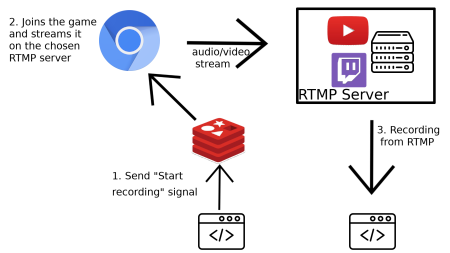

# Roll 20 streaming client

A remote-controlled Roll20 client used to stream roll20 audio and video feeds to an
RTMP server (Youtube, Twitch, or a custom one).

This is something I created to record some tabletop RPG games.
This is used along with [Pandora](https://github.com/SoTrxII/Pandora) to record both audio/video from Roll20 and audio
from Discord, to be later on mixed together.

## Features

- Join Roll20 games using a user account.
- Stream (audio and video) the game to any RTMP compatible server
- Tweaking Roll20 UI to maximize field view, removing any unnecessary UI widget for a recording,
  such as Zoom Level adjustment or drawing tools
- Inject custom JS client code into the Roll20 Window to customize it.
- Zoom in and out, move the recorded area with Redis messages.

## Usage



This programs takes input from Redis. Once the "Start recording" signal has reached it, it will join the Roll20 game
with the game url provided by Redis. It will then start streaming to a RTMP server. This RTMP server could really be
anything, be it Youtube, Twitch or a custom one (I use [this one](https://github.com/JasonRivers/Docker-nginx-rtmp) for example).

The RTMP server can then be recorded with an external program (or an FFMPEG command). Some live streaming platform even let
you record automatically while streaming.

### Redis

A Redis instance is used to handle communications. The program is always listening to these specific endpoints.


**Example : starting the recording**
```ts
// Starts the recording
redis.publish("startStreamingRoll20Game", {
  hasError: false,
  data: { gameUrl: "<Roll20 game invite url>" }
});
```
The Roll20 invite url is something like "https://app.roll20.net/join/9416441/0okbpm".
Once the recording has started, a message will be sent of the "streamingRoll20GameBegan" Redis channel.

**Example : stopping the recording**
```ts
// Stops the recording
redis.publish("stopStreamingRoll20Game", {
  hasError: false,
  data: null
});
```
Once the recording has stopped, a message will be sent of the "streamingRoll20GameStopped" Redis channel. This 
message will have a "startDate" attribute in the data field. This is the time when the recording started (useful for
multi-sources synchronisation purposes). This time is in the [hrtime format](https://nodejs.org/api/process.html#process_process_hrtime_time).

**Example : Moving the viewport**
```ts
// Move around
redis.publish("MoveRoll20RecordedFieldArea", {
  hasError: false,
  data: { bbox: "<Bounding Box of the area to record>" }
});
```

The bounding box is the new field subset to record. The zoom level will be adjusted automatically to match the 
given coordinates.
```ts
export interface Bbox{
  x: number,
  y: number,
  width: number,
  height: number
}
```

## Installation

### Requirements

A dedicated Pulseaudio sink must be created. The Chromium instance will dump all sound in this Sink.

```sh
# This is only a temporary sink
# You can edit pulseaudio config or add a startup script to make it persistent
SINK_NAME="roll20Sink"
pacmd load-module module-null-sink sink_name=$SINK_NAME
pacmd update-sink-proplist $SINK_NAME device.description=$SINK_NAME
pacmd load-module module-loopback sink=$SINK_NAME
```

FFMPEG is also required.

### Building

```sh
# In the project root diretory
npm install
npm build
# Removing devdependencies once the build process is done
npm prune --production  && npm install dotenv-safe
# Configuration
cp .env.example .env
# Fill the values in .env (see Configuration)
npm start:dev
```

Once you've reached this step, a chrome instance should be up and running, already logged in using the credentials you
provided.

## Configuration 

You can create a dedicated account for the program. All values are mandatory except for `CUSTOM_PAYLOAD_URL`.
The custom payload can be hosted somewhere. The payload will then be downloaded and evaluated. 
```DotENV
# Roll 20 Account info
ROLL20_LOGIN=
ROLL20_PASSWORD=

#Redis notifier info
REDIS_HOST=

#RTMP server url to pipe the recording into (with key for Twitch or Youtube) 
STREAMING_TARGET=

# A custom Javascript payload to be downloaded and injected.
CUSTOM_PAYLOAD_URL=
```

## About Docker

Although I'm a big fan of Docker, and there is a Dockerfile provided, **Docker shouldn't be used** to run
this project (at this state). The reason is Pulseaudio, the sound server currently used. Pulseaudio doesn't play nicely
when used as a standalone server within a container.
Sharing the host Pulseaudio via a cookie is pretty unstable, and the cookie would sometimes just timeout for
no apparent reason. I'm currently experimenting with sharing it over the network, or even going back to ALSA.
